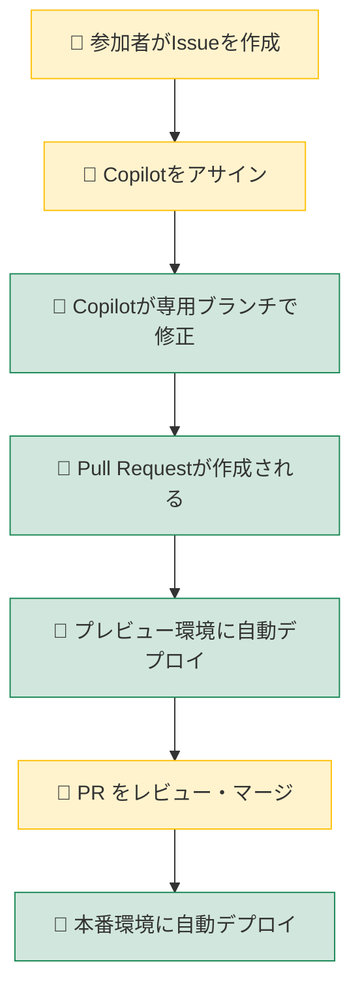
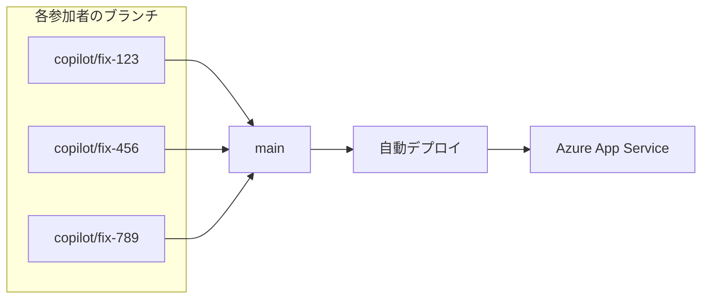

# ワークショップでの並行作業について

複数名で同時に作業する場合の注意事項です。

## 作業フロー

- 👤 **黄色**: 参加者が手動で行う操作
- 🤖 **緑色**: 自動で実行される処理

1. **Issue 作成**: 各参加者が修正内容を Issue として記載
2. **Copilot アサイン**: Issue に Copilot をアサイン
3. **自動修正**: Copilot が専用ブランチを作成し、コードを修正
4. **PR 作成**: 修正完了後、Pull Request が自動作成される
5. **プレビューデプロイ**: PR 作成時に Deployment Slot（プレビュー環境）に自動デプロイされ、PR コメントにプレビュー URL が通知される
6. **本番デプロイ**: PR を `main` にマージすると本番環境に自動デプロイ

## 🔍 PR プレビュー環境

Pull Request を作成すると、Azure Deployment Slots を使ったプレビュー環境が自動的に作成されます。

- **プレビュー URL**: `https://{webapp-name}-pr-{PR番号}.azurewebsites.net`
- **データ分離**: PR ごとに専用の Storage Table（`ExpensesPR{番号}`）を使用
- **自動クリーンアップ**: PR をクローズすると Slot が自動削除される

これにより、複数の参加者が同時に PR を作成しても、**それぞれの変更を独立したプレビュー環境で確認**できます。

## 並行デプロイについて

PR プレビュー環境により、各参加者の変更は独立した Deployment Slot にデプロイされるため、互いに影響しません。

本番環境（`main` ブランチ）へのデプロイは、PR をマージしたタイミングで実行されます。複数の PR を同時にマージした場合は `concurrency` 設定により重複実行が自動キャンセルされ、最新のデプロイのみが反映されます。

## 全員の変更をまとめてデプロイする場合

並行して作成された複数のブランチの変更を統合したい場合は、以下の手順で行います。

1. **各 PR を `main` ブランチにマージ**
   - コンフリクトがある場合は解消してからマージ
   - マージのたびに本番デプロイが自動実行される

2. **手動で再実行する場合**
   - GitHub → **Actions** タブ → **Deploy to Azure App Service** を選択
   - **Run workflow** ボタンをクリック
   - ブランチ: `main` を選択して実行

これにより、全員の変更が統合された状態で Azure にデプロイされます。
